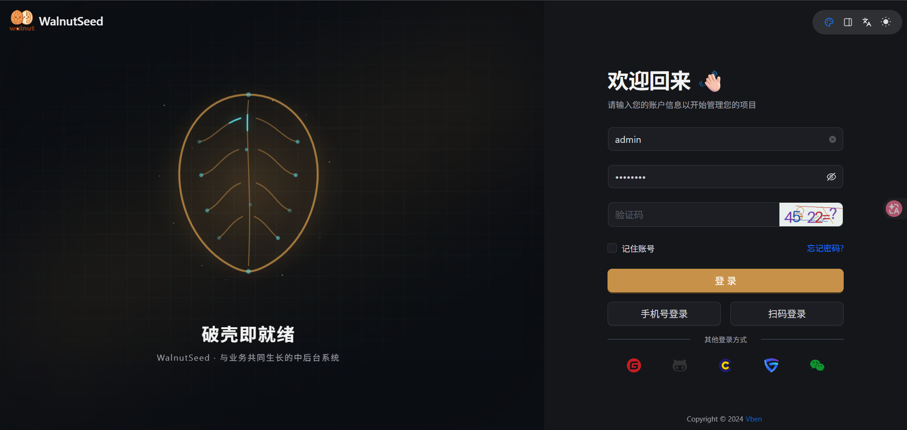

# Walnut-Seed

[](https://www.python.org/)
[](https://fastapi.tiangolo.com/)
[](https://openjdk.org/)
[](https://spring.io/projects/spring-boot)
[](https://vuejs.org/)
[](https://nodejs.org/)
[](https://docs.astral.sh/uv/)
[](https://pnpm.io/)

**English** | [简体中文](./README.md)

> **Full-Stack Admin Scaffold** — FastAPI (Python 3.12) / Spring Boot 3 (Java 25) + Vue 3 — a production-ready **admin dashboard boilerplate** with **RBAC, JWT auth, API encryption, database migrations, and Docker deployment** built in.

A modern **full-stack application scaffold** (boilerplate / starter template) for building **admin / back-office / management systems** out of the box:
**dual backends** — FastAPI (Python 3.12) and Spring Boot 3 (Java 25) — + **Vue 3 (Vben 5 / Ant Design Vue Next)** frontend. Both backends implement the **same API contract** (routes, response envelope, auth flow, API-encryption protocol), so the frontend switches between them without any change.

Use cases: rapidly scaffolding **enterprise admin panels**, **data dashboards**, **operation platforms**, and **SaaS multi-tenant systems**. Python and Java teams can share the same frontend and pick either backend.

```
GitHub: https://github.com/a605204746/walnut-seed
```



## Features

Built-in infrastructure, ready for real-world admin systems:

- **Dual backends, one contract** — Python (FastAPI) and Java (Spring Boot 3) implementations of the same API; same frontend, same contract, pick either per your team's stack, switch via a single compose file
- **Unified response envelope** — `{"code", "msg", "data"}` across every endpoint
- **Authentication & authorization** — JWT login, RBAC menu/button permissions, row-level data scopes (fail-closed)
- **Hardening by default** — rate limiting, idempotency (anti-resubmit), API request/response encryption (RSA + AES), XSS filtering
- **Caching & async primitives** — Redis-based cache/CRUD helpers, SSE and WebSocket support
- **File storage (OSS)** — any S3-compatible object store (SeaweedFS by default), switchable to Aliyun OSS
- **i18n** — `zh_CN` / `en_US` selected automatically via the `Accept-Language` header
- **Database migrations** — Alembic as the single source of truth for schema (no startup `create_all`)
- **Seed data** — full admin baseline: user / role / menu / dept / post / dict / config / notice / client / social / log
- **Ops-friendly** — health/liveness/readiness probes, structured Loguru logging, Typer CLI, all-endpoint smoke script

## Tech Stack

| Layer | Technologies |
| --- | --- |
| Backend (Python) | Python 3.12, FastAPI 0.138, SQLAlchemy 2.0 (async), Alembic, Redis (`redis.asyncio`), PyJWT, Loguru, Typer/Uvicorn; dependency management via **uv**; API encryption via `cryptography` (RSA + AES), optional China SM2/SM4 via `gmssl` |
| Backend (Java) | Java 25, Spring Boot 3.5, MyBatis-Plus, Sa-Token (JWT), Redisson, Flyway, springdoc; built with Maven (China mirror repositories baked into `pom.xml`) |
| Frontend | Vue 3.5, Vben 5.7.0, antdv-next 1.3.0 (successor of the unmaintained ant-design-vue); pnpm 11.2.2 + turbo monorepo; Node.js `^22.18.0 \|\| ^24.0.0` |
| Storage | MySQL 8 (the only supported database), Redis 7, SeaweedFS (S3-compatible object storage, switchable to Aliyun OSS) |

## Documentation

In-depth tutorials and design notes live in [`docs/`](./docs/README.md) (written in Chinese):

- **[Documentation index](./docs/README.md)** — guides split into shared, Python, Java, frontend, and deployment sections
- **[Add a New Business Module from Scratch](./docs/python/08-新增CRUD模块.md)** — the Python end-to-end walkthrough (five-file module → migrations → menus/permissions → frontend page)
- Development guides: menus & permissions, Alembic migrations, API encryption, i18n
- Architecture notes and deployment runbooks

Start here if you are building on top of the scaffold.

## Project Structure

```
walnut-seed/
  walnut-backend-python/    # Python backend (FastAPI + SQLAlchemy 2.0 async + Redis)
  walnut-backend-java/      # Java backend (Spring Boot 3 + MyBatis-Plus + Sa-Token), same contract as Python
  walnut-frontend/          # Vue 3 frontend monorepo (pnpm + turbo), main app in apps/web-antd/
  docker/                   # Compose stacks (Python / Java full stacks + middleware) and container configuration
  data/                     # Runtime artifacts (not in git, auto-created): logs/, upload/
```

### Backend Layout (Python)

```
walnut-backend-python/
  main.py                  # Typer CLI (run/revision/upgrade/downgrade/stamp/current/history) + create_app
  pyproject.toml           # uv dependency and tooling configuration
  alembic.ini              # Database migration configuration
  docker-entrypoint.sh     # Container entrypoint: alembic upgrade first, then start the app
  banner.txt               # Startup banner
  env/                     # .env.dev / .env.example environment configuration
  app/
    init_app.py            # lifespan + register_*
    config/                # setting.py / path_conf.py
    common/                # constants / enums / response / request / dataclasses
    core/                  # Infrastructure: database / migrate / redis_crud / security / dependencies /
                           # permission / middlewares / exceptions / logger / base_model /
                           # base_schema / base_crud / router_class / validator / idempotent /
                           # rate_limiter / sse / websocket / file_storage / encrypt
    utils/                 # Utilities: common / string / date / ip / xss / sql / import /
                           # excel / snowflake / i18n / banner
    api/v1/                # Business modules (module_*)
                           #   module_system: user/role/menu/dept/post/dict/config/notice/client/social/log
                           #   module_web: auth/captcha/register
                           #   module_common: health / file
                           #   module_resource: SSE / WebSocket
    seed/                  # Seed data (initialize.py + sql/)
    i18n/                  # messages_zh_CN / messages_en_US
    alembic/               # env.py / script.py.mako / versions/ (migration scripts)
  static/                  # swagger-ui / redoc / images
  scripts/                 # Dev scripts (smoke_all.py all-endpoint smoke test, key generators)
  tests/                   # pytest
```

Every business sub-module under `app/api/v1/module_*` follows the same five-file convention:

| File | Responsibility |
|---|---|
| `controller.py` | Route definitions and input validation entry point |
| `service.py` | Business logic orchestration |
| `crud.py` | Data access layer (built on `app/core/base_crud.py`) |
| `model.py` | SQLAlchemy ORM models |
| `schema.py` | Pydantic request/response models |

For local startup, logs are written under `data/logs/`; Docker binds backend logs to `docker/volumes/logs/`. Files are distinguished by filename: Python writes `walnut-seed-python.log`; Java writes `walnut-seed-java-console.log`, `walnut-seed-java-info.log`, and `walnut-seed-java-error.log` (rotated according to each backend's configuration).

### Backend Layout (Java)

```
walnut-backend-java/
  pom.xml                          # Maven build (Java 25 / Spring Boot 3.5; China mirror repos baked in)
  Dockerfile                       # Two-stage build: Maven packaging inside the image + Liberica JDK 25 runtime
  src/main/java/com/walnut/seed/
    WalnutSeedApplication.java     # Boot entry point
    common/                        # Infrastructure: response envelope / Sa-Token security / Redis (Redisson) /
                                   # API encryption / MyBatis-Plus / OSS / SSE / XSS / rate limit & idempotency
    module/web/                    # Auth (login/logout/register/captcha) + health checks + file endpoints
    module/system/                 # System management (user/role/menu/dept/post/dict/config/notice/client/social)
                                   # and monitoring (operation log / login log)
  src/main/resources/
    application*.yml               # Configuration (dev defaults; production overrides via environment variables)
    db/migration/                  # Flyway migrations (schema + seed data, same baseline as the Python backend)
```

The route surface matches the Python backend: `/auth/*`, `/system/*`, `/monitor/*`, `/common/health/*`, `/common/file/*`, `/resource/sse`, `/upload/*` (root prefix — the frontend proxy strips `/api`).

## Getting Started

```bash
git clone https://github.com/deepin/walnut-seed.git
cd walnut-seed
```

Prerequisites: Docker Desktop (with Compose); for native development also `uv` (Python 3.12), Node.js `^22.18.0 || ^24.0.0` and pnpm 11; running the Java backend natively additionally needs JDK 25 + Maven (Docker needs neither).

### Option A: Docker middleware + native apps (recommended for daily development)

Middleware (MySQL / Redis / SeaweedFS) runs in Docker; backend and frontend run natively on your machine (smoothest hot reload, easiest debugging).

Start the middleware first (MySQL `localhost:3307`, `root/walnut123`, databases `walnut_seed_python` / `walnut_seed_java` auto-created; Redis `localhost:6380`; SeaweedFS S3 API `localhost:8333`, filer UI `http://localhost:8888`):

```bash
docker compose -f docker/docker-compose.middleware.yml up -d
```

Then run the apps (pick ONE backend — both listen on the same port 8011, so the frontend needs no changes):

```bash
# Python backend
cd walnut-backend-python
uv sync
uv run main.py run --env dev   # http://localhost:8011

# or Java backend (needs JDK 25 + Maven)
cd walnut-backend-java
mvn spring-boot:run            # http://localhost:8011

# Frontend (new terminal)
cd walnut-frontend
pnpm install
pnpm dev:antd                  # http://localhost:8010
```

Connection settings live in `walnut-backend-python/env/.env.dev` (Python) and `walnut-backend-java/src/main/resources/application-dev.yml` (Java), both already pointed at the Docker middleware. The frontend dev server runs at `http://localhost:8010` and proxies `/api` to `http://localhost:8011`.

### Option B: full stack in Docker (production-like)

```bash
cp docker/.env.example docker/.env    # then set JWT_SECRET_KEY (mandatory, see below)

# Python backend full stack
docker compose -f docker/docker-compose.yml up -d --build

# or Java backend full stack (identical frontend; the two stacks share the middleware —
# stop one before starting the other)
docker compose -f docker/docker-compose.java.yml up -d --build
```

Open `http://localhost:8010` — initial account `admin / admin123` (**must be changed before production use**).

The stack includes MySQL 8 + Redis 7 + backend + frontend (nginx). On startup the backend container runs migrations before seeding data (Python: Alembic; Java: Flyway). All services carry restart policies and health checks. `JWT_SECRET_KEY` must be provided in `docker/.env` (enforced with compose `:?` in BOTH stacks — startup fails hard if missing or empty).

> The two full-stack compose files share middleware definitions (via `include`) and use mutually exclusive ports, so **they cannot run at the same time**. Stop either with `docker compose -f <file> down`. Middleware data persists in `docker/volumes` (MySQL/Redis bind mounts) and the `seaweedfs-data` named volume (SeaweedFS filer metadata silently disappears on Windows bind mounts, hence the named volume); backend logs are bind-mounted to `docker/volumes/logs` and remain after `down`. Middleware ports are non-default (MySQL 3307 / Redis 6380), so they normally don't clash with locally installed MySQL/Redis (3306/6379).

### Common Commands

Backend (inside `walnut-backend-python/`):

```bash
uv sync                                     # Install dependencies (including dev group)
cp env/.env.example env/.env.dev            # First run: copy env config (defaults target the Docker middleware)
uv run main.py run --env dev                # Start (bare `uv run main.py` is equivalent, dev is the default;
                                            # auto-migrates on startup when DATABASE_AUTO_MIGRATE=True)
uv run pytest                               # Tests
uv run python -m scripts.smoke_all          # All-endpoint smoke test (needs local Redis + initialized DB)
uv run ruff check .                         # Lint
uv run ruff format .                        # Format
```

Frontend (inside `walnut-frontend/`, uses pnpm):

```bash
pnpm install      # Install dependencies
pnpm dev:antd     # Dev server
pnpm build:antd   # Production build
```

> When API encryption is enabled, the RSA key pairs must be paired with the backend configuration — and there are **two pairs**: the frontend request-encryption key pairs with the backend decryption key, and the backend response-encryption key pairs with the frontend decryption key. See `apps/web-antd/.env.development`.

## Dual Backends (Python ↔ Java)

The two backends are **two implementations of one API contract** — the frontend and deployment layers are agnostic to which one runs:

| Contract surface | Parity |
|---|---|
| Routes | `/auth/*`, `/system/*`, `/monitor/*`, `/common/health/*`, `/common/file/*`, `/resource/sse`, `GET /upload/*` (root prefix) |
| Envelope | `{"code": 200, "msg", "data"}`, pagination `{"rows", "total"}`; business errors at HTTP 200 + body code |
| Auth | Same `clientId`, captcha flow, `access_token` response; `Authorization: Bearer` + `clientid` header |
| API encryption | RSA + AES hybrid via the `encrypt-key` header; the dev key pair is shared across all three parties (frontend `.env.development`, Python `env/.env.dev`, Java `application.yml`) |
| Seed data | Same baseline: `admin / admin123`, the pc client, full menus/roles/dicts |

Differences and caveats:

- **Separate databases**: Python uses `walnut_seed_python` (Alembic), Java uses `walnut_seed_java` (Flyway). Switching backends never cross-contaminates data, but **schema changes must be landed as migrations on both sides independently**
- **Independent JWT secrets**: each backend signs with its own key (compose injects both from the shared `JWT_SECRET_KEY`); switching backends invalidates existing frontend sessions (tokens are not cross-compatible)
- Encryption is **transparent** on both: requests carrying the `encrypt-key` header are decrypted automatically; plain requests pass through (the production frontend does not encrypt by default)
- Choosing: Python teams pick `walnut-backend-python`, Java teams pick `walnut-backend-java`; switching at the Docker layer is just a different compose file

## API Contract

- Unified response envelope: `{"code": int, "msg": str, "data": T | null}`
  - `code` 200 = success, 500 = failure, 601 = warning; business errors almost always return HTTP 200 — clients branch on `body.code`
- Pagination payload: `{"rows": [...], "total": N}`
- Error codes: the auth module uses the 10000-range (`AuthErrorCode`, e.g. 10005 = wrong username or password); other business errors return HTTP 200 + `code=500`; validation errors `code=400`; 401/403/404/405 return real HTTP status codes (still wrapped in the envelope)
- Authentication: `Authorization: Bearer <jwt>` + `clientid` request header
- JSON conventions: datetimes serialized as `yyyy-MM-dd HH:mm:ss`; big integers outside the JS safe-integer range are converted to strings

## Security

- **Key governance** — the JWT signing key is validated in production (placeholder / too short / unset ⇒ startup refused). API-encryption RSA keys ship with **no built-in defaults**: when keys are missing or invalid the encryption layer disables itself and raises a warning (never silently falls back to a default key); known publicly leaked keys are rejected outright. Generators: `uv run python scripts/gen_rsa_keys.py` (RSA key pairs), `scripts/gen_secret_key.py` (SECRET_KEY)
- **Route auth audit** — at startup every route is scanned; any route outside the whitelist (`WHITE_API_LIST_PATH`) lacking the auth dependency fails startup (fail-fast), eliminating "naked" endpoints caused by forgotten dependencies
- **Fail-closed data scopes** — when the data-permission component errors, access is denied rather than allowed; users without roles can only see their own data
- **Login protection** — login rate limit (10 attempts/min per IP); failure lockout counts by "username + IP" (prevents maliciously locking out someone else's account); identical error text for unknown user vs. wrong password (prevents account enumeration)
- **Trusted proxies** — `X-Forwarded-For` and friends are only parsed when the direct peer is in `TRUSTED_PROXY_IPS`; when deployed behind a reverse proxy you must configure this to match your topology, otherwise rate limits and audit logs attribute the direct connection address
- **File uploads** — extension whitelist (`ALLOWED_EXTENSIONS`) + size limit (`MAX_FILE_SIZE`); uploaded files are always served with `Content-Disposition: attachment` and `nosniff`, preventing stored XSS
- **Log masking** — password fields are stripped before writing logs (`EXCLUDE_PROPERTIES`: `password` / `oldPassword` / `newPassword` / `confirmPassword`)

## File Storage (OSS)

Default backend is **SeaweedFS** (any S3-compatible object store works; based on the minio SDK with generic `OSS_S3_*` config names). Set `OSS_TYPE=aliyun` to switch to Aliyun OSS (install `oss2` yourself).

The Docker stacks include a SeaweedFS service (single container `server -s3`: S3 API on 8333; filer UI at `http://localhost:8888`).

Note: with current SeaweedFS versions the static `-s3.config` identities don't take effect (upstream #4728/#8331) — the S3 gateway trusts callers by default. The compose stacks expose 8333/8888 only for intranet/host debugging; for public-facing production put it behind a firewall/proxy. The backend still sends AK/SK per configuration (the gateway accepts them).

- Object key pattern: `{yyyy/MM/dd}/{uuid}.{ext}`; the bucket is auto-created at backend startup
- Upload responses return URLs like `/upload/{key}` (a neutral path, renderable in any environment), streamed from object storage via `GET /upload/{key}`:
  - Local development: Vite proxies `/upload` → backend on 8011
  - Docker stack: nginx `location /upload/` → backend
- Related configuration: the "OSS file storage" section of `walnut-backend-python/env/.env.example`

## Database Migrations (Alembic)

The single source of truth for the schema is the migration scripts under `walnut-backend-python/app/alembic/versions/` — **startup-time `create_all` is no longer used**.

### When migrations run

| Environment | When | Notes |
| --- | --- | --- |
| dev (native) | Automatically at app startup | `DATABASE_AUTO_MIGRATE=True` in `.env.dev`; failure only warns and does not block startup |
| prod (Docker) | Explicitly before the container starts | `docker-entrypoint.sh` runs `upgrade head` first, then starts the app; failure is fail-fast |

### Day-to-day change flow

1. Modify the ORM models in `app/api/v1/**/model.py`;
2. `uv run main.py revision --env dev -m "change description"` — autogenerate diffs models against the database;
3. **Review the generated script by hand** (autogenerate can't cover everything, e.g. data migrations, index tweaks);
4. `uv run main.py upgrade --env dev` to apply it to your local database and verify;
5. Commit the migration script with your code — production applies it automatically via the entrypoint.

### Other commands

```bash
uv run main.py downgrade --env dev -r -1     # Roll back one step (-r base rolls back everything)
uv run main.py stamp --env dev               # Write the version marker without running DDL (adopting an existing DB)
uv run main.py current --env dev             # Show the current version
uv run main.py history --env dev             # Show the version chain
```

### Adopting an existing database (one-time)

For databases created by the old `create_all` flow whose structure already matches the models: run `uv run main.py stamp --env dev` to write `alembic_version` (no DDL is executed). **Never run `upgrade` directly on an unstamped legacy database** (it fails because the tables already exist). For Docker instances it's usually simpler to delete `docker/volumes` and recreate.

### Caveats

- MySQL DDL is not transactional (`transaction_per_migration` has no effect on DDL): a migration that fails halfway can leave a partially applied schema — verify database state by hand, then re-run `upgrade` or `stamp`.
- Rolling back the initial migration drops all tables — do it only against a sandbox database.
- Constraint/index naming follows `NAMING_CONVENTION` in `app/core/base_model.py` (`ix_*`/`uq_*` etc.). The first autogenerate after stamping a legacy DB may show cosmetic index renames — either keep them (converging the naming) or prune them manually.

## Configuration Layout

Principle: **deployment-level configuration lives in `docker/`, application-level configuration stays with the app**. Container environment variables flow exclusively through compose — no extra env files.

### "I want to change X — where do I go?"

| What you want to change | Where | Notes |
|---|---|---|
| Local-dev Python backend behavior (DB connection, keys, etc.) | `walnut-backend-python/env/.env.dev` | Only the diffs; everything else falls back to code defaults |
| Local-dev Java backend behavior | `walnut-backend-java/src/main/resources/application-dev.yml` | dev profile defaults |
| A Python config item's default in any environment | `walnut-backend-python/app/config/setting.py` | The single source of truth; changes affect all environments |
| Python backend env vars for the Docker deployment | `backend.environment` in `docker/docker-compose.yml` | Environment variables take precedence over env files |
| Java backend env vars for the Docker deployment | `backend.environment` in `docker/docker-compose.java.yml` | Spring relaxed-binding env vars (`SPRING_*`) override the yml |
| Shared values: passwords / JWT secret / backend port | `docker/.env` (template `.env.example`) | Compose variable interpolation — change once, applies to both stacks |
| Middleware port mappings / health checks / launch args | `docker/docker-compose.middleware.yml` | Shared by all stacks |
| Frontend nginx routing / proxying / HTTPS | `docker/config/nginx.conf` | Injected into the frontend image at build time via `additional_contexts`; rebuild with `--build frontend` after changes |
| Frontend build-time vars (API URL, RSA public keys, etc.) / dev proxy | `walnut-frontend/apps/web-antd/.env.*`, `vite.config.ts` | Injected at build time / Vite dev-server proxy |

### Backend configuration precedence

```
Real environment variables (injected by compose / shell)
  > env/.env.{ENVIRONMENT} files (local development)
  > code defaults in setting.py (fallback)
```

The Docker image does not bundle the `env/` directory (see `.dockerignore`) — all container configuration comes from compose environment variables. `docker/.env` is compose's **variable interpolation file** and is a completely separate mechanism from the backend's `env/` directory.

## First Deployment Checklist

1. `cp docker/.env.example docker/.env`, and **set `JWT_SECRET_KEY`** (enforced with compose `:?` — startup fails if missing or empty):
   `python -c "import secrets; print(secrets.token_hex(32))"`
2. Adjust `DB_PASSWORD` if needed (note: the MySQL password of an already-initialized volume does not change when you edit this value — run `ALTER USER` to sync it)
3. `docker compose -f docker/docker-compose.yml up -d --build` (use `docker-compose.java.yml` for the Java backend)
