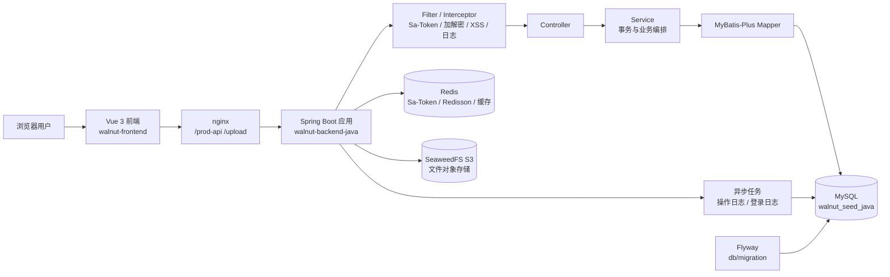
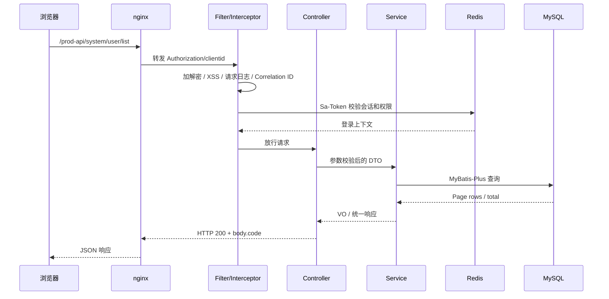
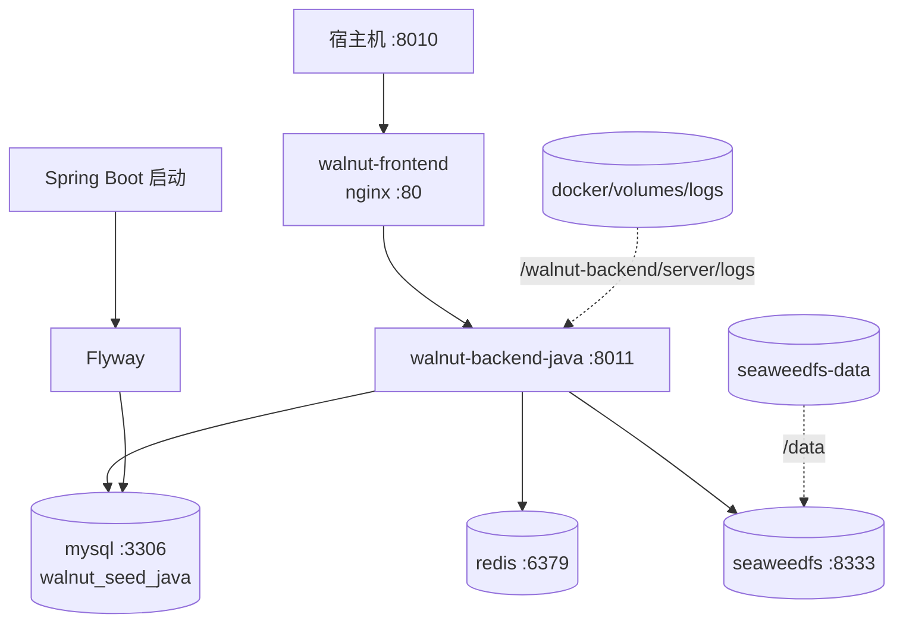

# Java 后端设计

Java 后端实现遵循本目录的 [接口契约](./04-接口契约.md)，运行时采用 Spring Boot 体系。

## 0. 系统架构总览



### 0.1 请求与组件职责

| 层次 | 代码位置 | 主要职责 | 事务边界 |
|---|---|---|---|
| 前端与 nginx | `walnut-frontend/`、`docker/config/nginx.conf` | 页面、API 代理、静态资源、上传转发 | 无 |
| Web 层 | `module/web/`、Controller | 接收参数、权限注解、响应封装 | 通常不直接提交事务 |
| 业务层 | `module/*/service` | 业务规则、事务编排、审计字段 | `@Transactional` |
| 持久化层 | `mapper/`、Entity、MyBatis-Plus | SQL 映射、分页、逻辑删除 | 参与 Spring 事务 |
| 基础设施 | `common/` | Sa-Token、Redis、OSS、加解密、异常、日志 | 由调用方决定 |
| 数据库迁移 | `src/main/resources/db/migration/` | 按版本升级表结构和种子数据 | Flyway 管理 |

## 0.2 请求时序图



## 0.3 Docker 部署拓扑



## 请求链路

```text
HTTP
 -> Spring Filter/Interceptor
 -> Sa-Token 登录与权限校验
 -> Controller
 -> Service
 -> MyBatis-Plus Mapper
 -> MySQL
```

## 模块组织

业务代码位于 `module/system` 和 `module/web`，通常按 Controller、Domain/DTO、Service、Mapper、Entity 组织。横切能力位于 `common/`，包括统一响应、异常处理、Redis、对象存储、接口加解密、XSS、限流和实时通信。

## 配置与迁移

- 开发/生产配置分别位于 `application-dev.yml` 和 `application-prod.yml`。
- Docker 通过 Spring relaxed binding 注入数据库、Redis、OSS 和 JWT 配置。
- Flyway 在 Spring Boot 启动时执行 `db/migration/` 下的版本脚本。
- Java 使用独立数据库 `walnut_seed_java`，不会直接复用 Python 的迁移状态。
