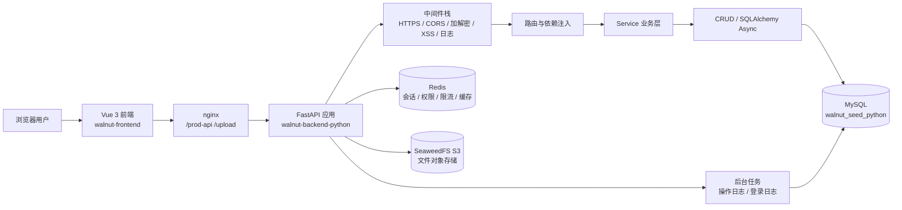
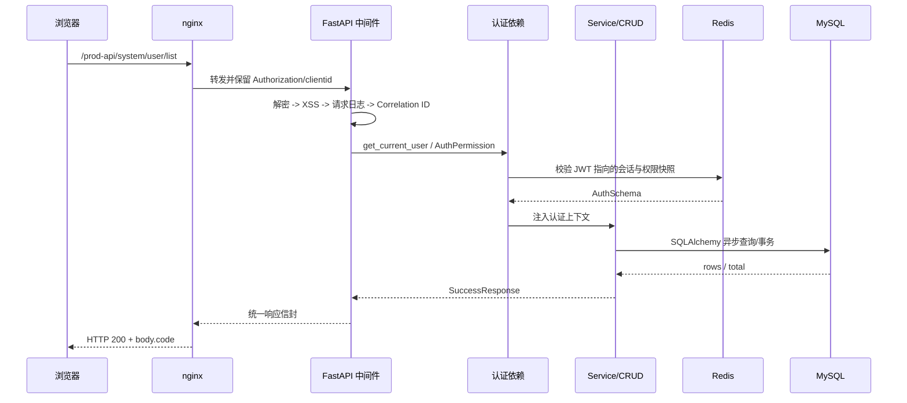
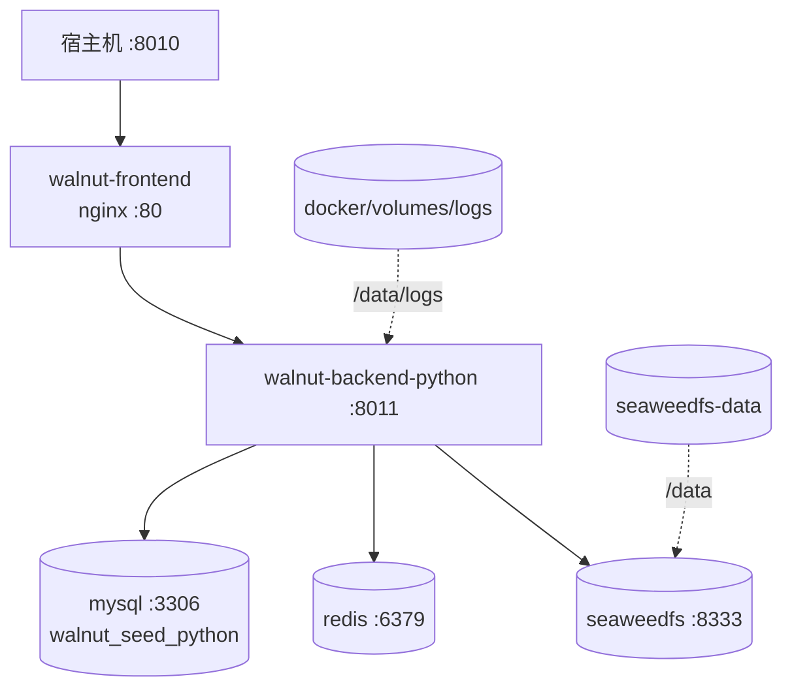

# 后端设计

> 更新日期：2026-08-19 · 适用版本：WalnutSeed v1.0

本文讲 Python 后端框架层的设计决策与机制：响应信封与异常如何映射、认证与权限链路、中间件栈、数据层约定。**改框架本身之前先读这篇**；在它之上做业务开发请优先看 [新增 CRUD 模块](./08-新增CRUD模块.md)。接口协议见 [接口契约](./04-接口契约.md)。

## 0. 系统架构总览



### 0.1 请求在系统中的位置

| 层次 | 代码位置 | 主要职责 | 不负责什么 |
|---|---|---|---|
| 前端与 nginx | `walnut-frontend/`、`docker/config/nginx.conf` | 页面、请求封装、反向代理、静态文件 | 最终权限校验、数据库事务 |
| 应用入口 | `main.py`、`app/init_app.py` | 创建应用、注册路由/中间件/异常处理 | 编写具体业务规则 |
| 横切中间件 | `app/core/*middleware*` | 加密、XSS、CORS、日志、请求 ID、压缩 | 业务数据查询 |
| API 层 | `app/api/v1/` | 参数校验、认证依赖、响应封装 | 直接拼接跨模块 SQL |
| Service/CRUD | 各业务模块 `service.py`、`crud.py` | 业务编排、数据权限、事务内读写 | 处理 HTTP 细节 |
| 基础设施 | `app/core/`、`app/common/` | 数据库、Redis、OSS、异常、权限 | 页面路由和 UI |

## 0.2 请求时序图



## 0.3 Docker 部署拓扑



## 1. 响应与异常

### 1.1 统一响应信封

所有业务响应都是 `{"code": int, "msg": str, "data": T | null}`（`app/common/response.py`）：

```python
class ApiResponse(BaseModel):
    code: int = 200          # 业务状态码
    msg: str = "操作成功"
    data: T | None = None
    # code 语义：200 成功 / 500 失败 / 601 警告
```

响应类层次：`EnvelopeResponse(JSONResponse)` 为基类，`SuccessResponse`（code=200）、`ErrorResponse`（code=500，**HTTP 默认仍 200**）、`WarnResponse`（code=601，用于"存在下级部门不允许删除"这类业务告警）。非信封响应另有 `StreamResponse`、`UploadFileResponse`、Excel 导出等。

**核心设计：HTTP 状态码与业务 code 解耦。** 业务异常几乎都返回 HTTP 200，真实语义写在 `body.code`，前端据此分支（如 `code==401` 跳登录）。这样做的代价与收益、以及哪些场景例外，见 1.3。

**包装方式是"路由显式返回"，没有全局拦截**：成功路径端点显式 `return SuccessResponse(data=...)`；失败路径统一由全局异常处理器生成 `ErrorResponse`。

**JSON 序列化规则**（`jsonable_response_content`）：

- 日期时间统一 `yyyy-MM-dd HH:mm:ss`；
- **超出 JS 安全整数范围（±9007199254740991）的整数自动转字符串**——雪花 ID 防前端精度丢失；
- `Decimal → str`；`bool` 直通（防被 int 规则误转）。

分页载荷固定 `{"rows": [...], "total": N}`（`PageResult`）。

### 1.2 异常分层

```
Exception
└── AppBaseException            # module / message_code(i18n) / args / default_message
    └── ServiceException        # 唯一业务异常：code + message + detail_message(prod 不外泄)
        ├── NotLoginException       # 默认 code=401
        ├── NotPermissionException  # 默认 code=403
        └── NotRoleException        # 默认 code=403
```

`ServiceException` 三种用法（详见 [国际化](./07-国际化.md)）：

```python
raise ServiceException("用户名已存在")                          # 硬编码
raise ServiceException(message_code="repeat.submit.message")    # i18n key
raise ServiceException.of(AuthErrorCode.USER_BLOCKED, username) # 错误码枚举
```

### 1.3 异常处理器与 HTTP 状态码映射

`handle_exception(app)`（`app/core/exceptions.py`）注册的 handler 及映射：

| 触发 | HTTP 状态码 | 信封 code | 说明 |
|---|---|---|---|
| `ServiceException`（含 NotLogin/NotPermission/NotRole） | **200** | `exc.code`（401/403/10001+…） | 业务异常主通道 |
| `RequestValidationError` | **200** | **400** | 参数校验，**不是 FastAPI 默认的 422** |
| starlette `HTTPException` | **真实状态码** | 同状态码 | 路由 404、方法 405 等 |
| `SQLAlchemyError` | **200** | `IntegrityError`→409，其余 500 | 唯一键冲突→"记录已存在"；外键→"存在关联数据" |
| `ValueError` | **200** | 400 | |
| 兜底 `Exception` | **200** | 500 | "发生系统异常"，`logger.exception` 记全栈 |

**结论**：返回真实 HTTP 状态码的只有 starlette `HTTPException`（404/405/显式抛）与健康探针的 503；**401/403 这类业务语义走 HTTP 200 + body.code**。新增接口时遵循此契约，不要混用。

### 1.4 错误码段约定

- `code=200/400/500/601` 为通用语义；
- **认证模块使用 10000–19999 段**（`AuthErrorCode`，`app/api/v1/module_web/exception.py`），每个枚举携带 i18n 消息键，如 `USER_PASSWORD_NOT_MATCH=10005`（用户不存在与密码错误统一此码，**防用户枚举**）；
- 新业务域如需独立错误码段，沿用"域独占一段"的约定，避免与 10000 段冲突。

## 2. 认证与权限链路

### 2.1 JWT + Redis 会话

登录后服务端生成 `session_id`，写 Redis 三键：`user_session:<sid>`（会话 JSON：user_id/dept_id/menu_permission/role_permission/menu_ids…）、`access_token:<sid>`（JWT）、`online_tokens:<token>`（在线用户）。JWT 载荷的 `sub` 就是 session_id——**token 只是会话指针，真实权限数据在 Redis**。

每次请求 `get_current_user`（`app/core/dependencies.py`）重建上下文：解 JWT → 校验固定 `exp` 硬过期 → 拒绝 refresh token → 校验 `clientid` 头与载荷一致 → 读 Redis 会话 → 组装 `AuthSchema` 挂到 `request.state`。**滑动过期**（`TOKEN_SLIDING_EXPIRE=True`）：Redis 会话中的 `_active_timeout` 控制不活跃失效时间，TTL 过半程时按 `min(active_timeout, JWT exp 剩余时间)` 同步续期会话键、令牌键和在线用户缓存。会话有效期实际由 `sys_client` 表控制（如 pc 客户端：30 分钟不活跃失效 + 7 天硬上限）。

### 2.2 AuthPermission 鉴权

```python
AuthPermission(permissions=["system:user:add"], roles=[...], mode="AND", role_mode="OR")
```

- 超级管理员（`user.id==1`）或持 `*`/`*:*:*` 直接放行；
- 角色组、权限组**先后都要通过**（AND/OR 只作用于组内）；
- 角色不满足抛 `NotRoleException`、权限不满足抛 `NotPermissionException`（均 HTTP 200 + code=403）。

### 2.3 启动路由认证审计（fail-fast）

`audit_routes_auth`（`app/init_app.py`）启动时遍历全部路由：白名单 `WHITE_API_LIST_PATH`（登录/验证码/健康检查/静态资源/`/upload/*`/文档等）之外的路由**必须**携带 `AuthPermission` 或 `get_current_user` 依赖，否则 `RuntimeError` 拒绝启动——从机制上杜绝"漏挂依赖导致接口裸奔"。新接口忘挂依赖时你会在启动日志见到它，**别绕过，补上依赖**。

### 2.4 数据权限（行级）

`app/core/permission.py` 的 `Permission` 组件按角色 `data_scope`（全部/自定义/本部门/本部门及以下/仅本人/…）给查询追加 SQL 条件，**fail-closed**：无角色仅本人、组件异常拒绝访问。完整六种范围与接入方式见 [菜单与权限配置](../python/05-权限配置.md#4-数据权限行级)。

## 3. 中间件栈

注册机制：`register_middlewares` 把 `settings.MIDDLEWARE_LIST` **逆序** `add_middleware`，使列表第一项位于最外层。从外到内：

| # | 中间件 | 条件 | 职责要点 |
|---|---|---|---|
| 1 | `CustomHTTPSRedirectMiddleware` | prod 且 `HTTPS_REDIRECT=True` | HTTP→HTTPS 301，信任 `X-Forwarded-Proto` |
| 2 | `CustomTrustedHostMiddleware` | 仅 prod | Host 头校验（`ALLOWED_HOSTS`） |
| 3 | `CustomCORSMiddleware` | 恒挂 | prod 读 `PROD_CORS_ORIGINS`，否则 `["*"]`；暴露 `X-Request-ID`/`encrypt-key` 等 |
| 4 | `LocaleMiddleware` | 恒挂 | 解析 `Accept-Language` 写 ContextVar（**纯 ASGI**，保证与业务同任务可见，见 i18n 文档） |
| 5 | `ApiDecryptMiddleware` | `API_DECRYPT_ENABLED` | 请求解密（被动）/响应加密（`@api_encrypt` 标记） |
| 6 | `XssMiddleware` | `XSS_ENABLED` | 清洗 JSON body，`XSS_EXCLUDE_URLS` 豁免富文本（如 `/system/notice`） |
| 7 | `RequestLogMiddleware` | 恒挂 | 打印开始/结束请求与耗时，**剔除 password 等敏感字段** |
| 8 | `CustomGZipMiddleware` | 恒挂 | `GZIP_MIN_SIZE`/压缩级别可配 |
| 9 | `CorrelationIdMiddleware` | 恒挂 | 最内层；生成/透传 `X-Correlation-ID`，日志追加 `cid=` |

顺序的含义：**加解密在 XSS 与请求日志之前**，所以日志记录的是解密后的参数（已脱敏）；异常处理器（`ExceptionMiddleware`）紧贴路由，业务异常先转成信封再向外穿过 GZip/日志/CORS。

## 4. 数据层约定

### 4.1 模型基类与主键

`app/core/base_model.py`：

- `BaseEntity`：雪花主键 `id`（`autoincrement=False, default=IdGeneratorUtil.next_long_id`）+ 审计字段 `create_dept/create_by/create_time/update_by/update_time`（由 `CRUDBase` 从登录上下文自动填充，未登录回退 `-1`）；
- Mixin：`SoftDeleteMixin`（`del_flag` 逻辑删除）、`TreeEntityMixin`（`parent_id/ancestors/order_num` 树形）；
- **`NAMING_CONVENTION`**：约束/索引统一命名（`pk_表名`、`uq_表名_列`、`ix_列`…），让 Alembic autogenerate 命名稳定——迁移相关见 [迁移实战](./09-数据库迁移-Alembic.md)。

雪花 ID：41 位时间戳 + 10 位机器位 + 12 位序列；**多副本部署必须为每实例显式配置互不相同的 `SNOWFLAKE_WORKER_ID`**（否则回退按 IP+PID 推导，有碰撞风险，见 [生产清单](../python/11-生产上线清单.md)）。

### 4.2 CRUDBase 通用能力

`app/core/base_crud.py` 的 `CRUDBase(model, auth, db)` 提供：

| 类别 | 方法 |
|---|---|
| 查询 | `get`（主键）、`get_by(**filters)`、`list_all(*conditions)`、`page(page, *conditions)`（count+排序+分页，返回 `{rows,total}`） |
| 写入 | `create`（补雪花 ID+审计）、`update`（merge+审计）、`delete`、`delete_batch(ids)` |
| 排序 | `_apply_order`：`orderByColumn` 驼峰转 snake_case，先过 `escape_order_by_sql` 防注入 |

**`AuthSchema` 传入链**：端点 `Depends(get_current_user)` 拿到 → 传给 `XxxService(auth, db)` → service 里 `XxxCrud(Model, auth, db)`——CRUD 层据此填充审计字段、做数据权限。无登录上下文的后台任务（如操作日志落库）传空 `AuthSchema()`，审计字段落 `-1`。

### 4.3 会话与事务约定

- **请求级**：`db_getter` 一个请求一个会话 + 一个事务（`session.begin()`），端点内不显式 commit，异常自动回滚；
- **后台级**：操作日志/登录日志消费者各自独立开会话，不与请求事务耦合；
- 引擎：aiomysql 异步引擎，`pool_pre_ping=True`、`pool_use_lifo=True`；同步引擎仅供 Alembic 迁移使用。

## 5. 设计主线小结

1. **传输状态与业务状态分离**：除路由级 HTTP 异常与健康探针外几乎全返回 HTTP 200，真实语义在 `body.code`；
2. **fail-safe 启动 + 安全 fail-fast**：DB/Redis/OSS 初始化失败降级不阻断，但密钥与路由认证审计在 prod 一律拒绝启动；
3. **横切能力全部显式挂载、无魔法**：缓存是显式 cache-aside，限流/防重是 `Depends(...)`，操作日志是 `route_class + @log`，加解密是中间件 + 端点标记——每项能力都有明确的挂载位置与配置开关。
